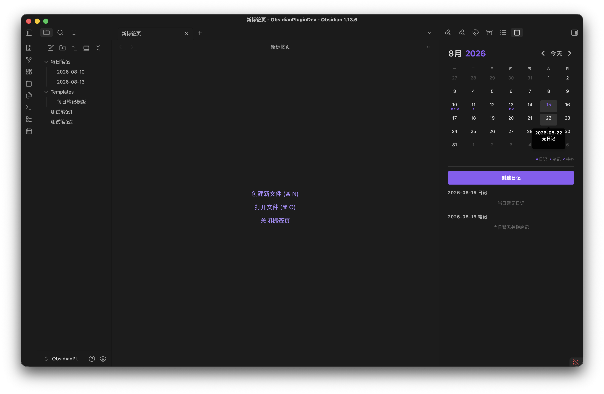
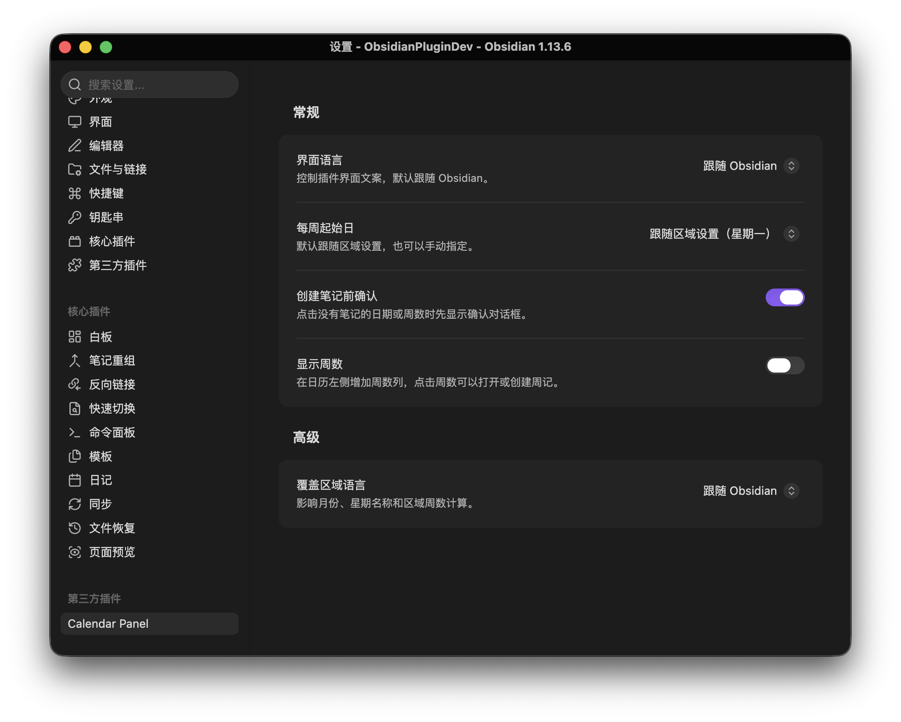

# Calendar Panel

[**中文**](./README.md) | [English](./README_EN.md)

> 本项目以 Obsidian 官方的 [obsidian-sample-plugin](https://github.com/obsidianmd/obsidian-sample-plugin) 为工程与发布规范参考，日历功能参考 Liam Cain 的 [obsidian-calendar-plugin](https://github.com/liamcain/obsidian-calendar-plugin)。

这是一个为 Obsidian 设计的插件，创建一个简单的日历视图，用于可视化和导航每日笔记。


## 功能

- 跳转到任何**每日笔记**。
- 使用当前的**每日笔记**模板为没有笔记的日期创建新的每日笔记。
- 在右侧边栏显示月历，支持切换上月、下月和返回今天，也可以通过月/年选择器快速跳转。
- 默认展示当天内容；选择日期后，在日历下方显示对应日记或创建入口。
- 日历面板中，实心圆点表示当日日记存在，空心圆点表示笔记中存在待办任务。
- 可选显示周数；点击周数打开或创建周记。
- 按住 `Ctrl` 或 `Command` 点击，在新分栏中打开日记或周记。
- 按住 `Ctrl` 或 `Command` 悬停，使用 Obsidian 原生链接预览查看已有笔记。



## 语言与日期

- “界面语言”控制按钮、设置、命令、提示和无障碍文案，可选择跟随 Obsidian、中文或 English。
- 跟随 Obsidian 时，中文区域使用中文界面，其他区域回退为英文。
- “覆盖区域语言”仅控制月份、星期名称和区域周数规则，与界面语言相互独立。
- 用户可见的完整日期统一显示为 `YYYY-MM-DD`；月份标题、星期名称及笔记文件名仍遵循各自的区域或周期笔记配置。



## 配置来源

### 日记

插件按以下顺序读取日记配置：

1. Obsidian 核心 Daily Notes 插件配置。
2. 默认格式 `YYYY-MM-DD` 和仓库根目录。

创建日记时会沿用所选配置的文件名格式、目录和模板。

### 周记

开启“显示周数”后，插件按以下顺序读取周记配置：

1. Calendar Panel 设置中的周记格式、目录和模板。

## 命令

插件注册以下命令，并根据界面语言显示对应文案：

- **Calendar Panel: 打开日历视图 / Open calendar view**
- **Calendar Panel: 打开本周周记 / Open current weekly note**
- **Calendar Panel: 在日历中定位当前笔记 / Reveal active note in calendar**

插件启用后也会在左侧功能区添加日历图标，并在 Obsidian 工作区布局准备完成后自动创建右侧日历视图。

## 手动安装

Calendar Panel 最低支持 Obsidian `1.13.0`。

1. 下载 Release 中的 `main.js`、`manifest.json` 和 `styles.css`，或在本地执行 `npm run build` 生成这些文件。
2. 在 Obsidian 仓库中创建插件目录：

   ```text
   <Vault>/.obsidian/plugins/calendar-panel/
   ```

3. 将以下文件复制到该目录：

   ```text
   main.js
   manifest.json
   styles.css
   ```

4. 重启 Obsidian，或重新加载插件。
5. 前往 **设置 → 第三方插件**，启用 **Calendar Panel**。

## 隐私与网络访问

Calendar Panel 完全在本地运行：

- 不收集分析数据。
- 不发送仓库内容、文件名或插件设置。
- 不调用外部网络服务。
- 只通过 Obsidian API 读取和创建仓库内的 Markdown 文件。

## 许可证

本项目使用 [MIT License](./LICENSE)。
